# Architecture — ICE Platform (as implemented)

**Document:** The architecture that exists in the repository today (branch `claude-development`).
**Date:** August 9, 2026
**Basis:** Direct source inspection + verified runtime (33/33 tests, live Postgres inspected).

Diagrams use [Mermaid](https://mermaid.js.org/) (`flowchart` / `sequenceDiagram`).

---

## 1. System architecture

Single-service monolith: a React SPA over a versioned FastAPI API backed by PostgreSQL. Redis is provisioned in the dev stack but **referenced by no code path**.

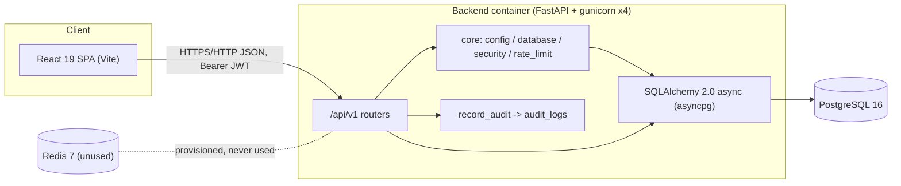

**Scope constraints (deliberate):**
- One backend service, one database, one frontend. No microservices, no separate services/repositories layer, no message broker, no object storage in use.
- PostgreSQL is the only persistent store; Redis is plumbed (URL, container) but unused.
- Target scale is the documented profile: ~10-15 concurrent residential projects.

---

## 2. Frontend architecture

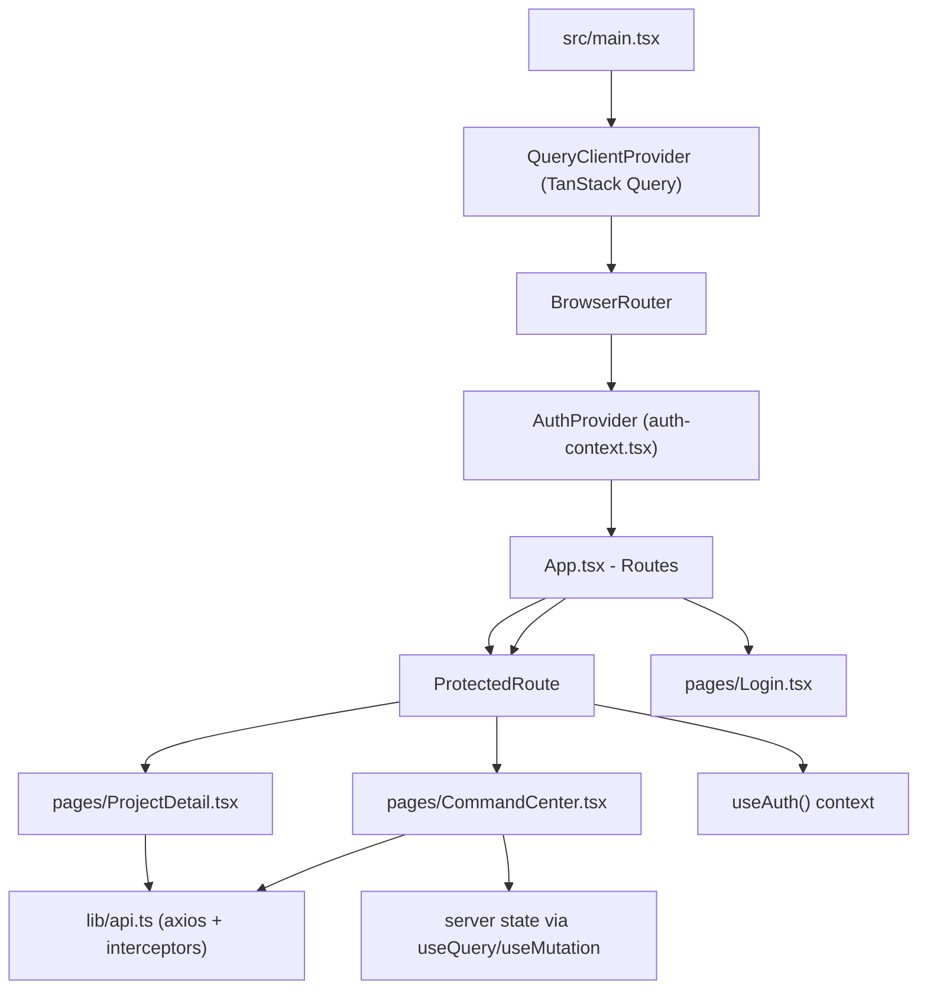
- **Routing:** 4 routes — `/login`, `/google/callback`, `/` (protected → Command Center), `/projects/:projectId` (protected → Project Detail).
- **State:** TanStack Query for server state (staleTime 30s, retry 1); local `useState` for forms; `AuthContext` for identity + bootstrap.
- **API client (`lib/api.ts`):** axios instance with a request interceptor (injects `Authorization: Bearer`) and a response interceptor that performs a **single-flight refresh** on 401, retries the original request once, then redirects to `/login`. Access token is module-level (memory only); refresh token in `localStorage`.
- **Data fetching:** each page/panel owns its query (`projects`, `project`, `tasks`, `site-logs`, `inventory`); mutations invalidate the matching cache key.
- **UI:** Tailwind design system ("blueprint/ink" theme); dedicated components — `AppShell` (sidebar + header), `ProjectCard`, `KpiStrip`, `HealthDot`, `ProjectTimeline`, `DailySiteLogs`, `InventoryPanel`.

### Key auth-token flow (frontend)

```mermaid
sequenceDiagram
    participant App as SPA
    participant Ax as axios interceptor
    participant Web as AuthProvider
    participant API as FastAPI /api/v1

    App->>Web: mount (bootstrap)
    Web->>Ax: read refresh token from localStorage
    Ax->>API: POST /auth/refresh {refresh_token}
    API-->>Ax: access + refresh pair
    Ax->>Ax: keep access token in memory; store new refresh in localStorage
    Ax->>API: GET /auth/me
    API-->>Web: user -> context

    App->>Ax: request with expired access token
    Ax->>API: original request -> 401
    Ax->>API: POST /auth/refresh (single-flight, deduped)
    API-->>Ax: new access token
    Ax->>API: retry original request
```

---

## 3. Backend architecture

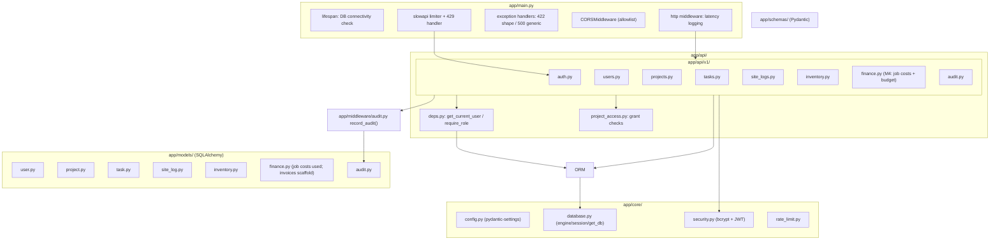

**Layering note:** routes depend directly on models/schemas/core. There is **no full `services/` or `repositories/` layer** — most handlers perform validation, authorization, business logic, persistence, and audit inline. Schemas are the request/response contracts; models are the persistence layer. Thin services hold inventory, finance, health, lifecycle and Google OAuth integration logic; M11's `app/services/google_auth.py` contains the external OAuth exchange and ID-token verification.

### Request lifecycle

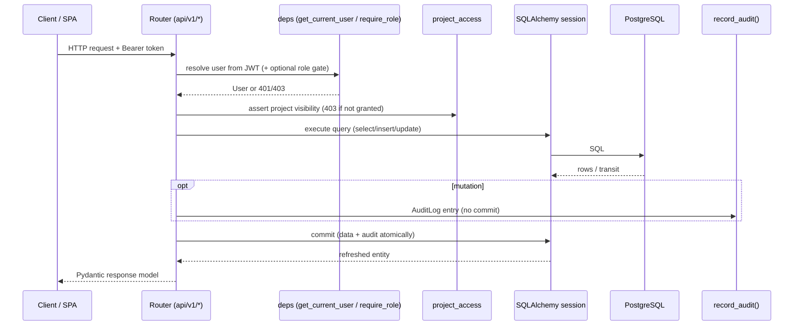

---

## 4. Database architecture

- **Engine:** PostgreSQL 16, async SQLAlchemy sessionmaker, pool_size 10 / max_overflow 20, `pool_pre_ping=True`, `expire_on_commit=False`.
- **Migrations:** Alembic revisions through M11 head `i7d8e9f0a1b2`, applied at container startup (compose) or manually in prod; credentials read from app settings in `alembic/env.py`.

### Entity relationship (as implemented)

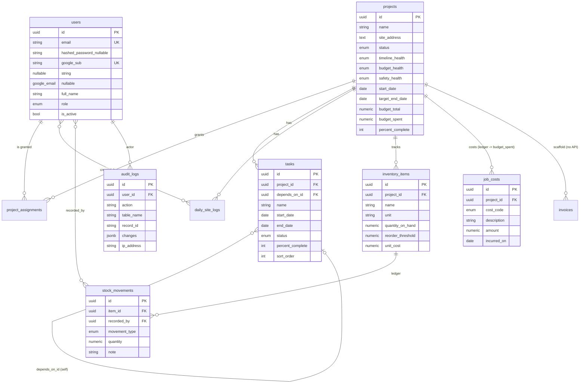

### Key design points
- **Inventory is ledger + running total:** `quantity_on_hand` on `inventory_items` is denormalized; every change appends an immutable `stock_movements` row (received/adjusted = +, consumed/transferred = −). The ledger is the audit-grade source of truth.
- **Budget is ledger + running total (Phase 3 M4):** `Project.budget_spent` is denormalized and recomputed from `SUM(job_costs.amount)` in the same transaction as every cost mutation; `GET /projects/{id}/budget` re-derives the roll-up from the ledger on read. Project rows are locked (`SELECT ... FOR UPDATE`) on cost mutations — like M1's inventory row-lock — so concurrent writes serialize and `budget_spent` can't drift from the ledger.
- **Finance data is admin/proc only (Phase 3 M4):** job-cost ledger and budget roll-up reads are restricted to admin/procurement; clients/supervisors get 403 (never leak `budget_*` to client).
- **Append-only records:** `audit_logs` and `daily_site_logs` are written but never updated/deleted via any endpoint.
- **Money:** `Numeric(14,2)` on budgets/costs; `Numeric(12,2)` on quantities.
- **Constraints:** unique email (indexed); FK indexes on project-scoped tables; native Postgres enums; **no `CHECK` constraints at the DB level** (e.g., `percent_complete` 0-100 is enforced only by Pydantic).
- **Transactions:** every mutation commits its data row + audit row in one transaction.
- **Known gaps:** no row locking on inventory read-modify-write (concurrency race) — **RESOLVED Phase 3 M1 (row lock + reconciliation)**; no uniqueness on `(project_id, user_id)` assignments — **RESOLVED Phase 3 M2** — still missing on `(project_id, name)` inventory and `(project_id, log_date)`; no audit index on `table_name`/`created_at`.

---

## 5. Authentication / authorization

### Authentication
- `POST /api/v1/auth/login` — verify email + bcrypt password; returns an HS256 access JWT (30 min) plus an opaque M9 refresh token (7 days) stored only as a SHA-256 digest.
- `POST /api/v1/auth/refresh` — accepts a valid opaque refresh token, rotates it under a row lock, re-checks the user is active, and issues a new pair.
- `GET /api/v1/auth/me` — returns the current user from the bearer access token.
- `GET /api/v1/auth/google/authorize` — public, rate-limited Authorization Code + PKCE start; returns HMAC state, nonce, verifier and Google consent URL.
- `POST /api/v1/auth/google/callback` — public, rate-limited server-side code exchange and RS256 ID-token verification; links/resolves the ICE user and issues the normal M9 token pair.
- **Rate limiting:** slowapi — 5/min on login, 10/min on refresh, 10/min on logout and Google authorize/callback (per process, in-memory).

### Authorization
- `get_current_user` (deps) — decodes access token, loads user from DB, 401 if missing/inactive.
- `require_role(*roles)` — dependency factory; 403 if the user's role is outside the allowed set.
- `assert_can_view_project` (project_access) — admin + procurement may access any project; supervisor/client must have a `project_assignments` row.

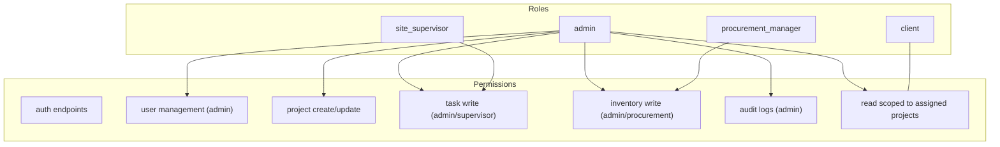

**Implemented matrices:**
| Domain | Read | Write |
|---|---|---|
| Users | admin | admin |
| Projects | all (scoped) | admin; supervisor (assigned only, incl. health fields) |
| Tasks | all (scoped) | admin / assigned supervisor |
| Site logs | all (scoped) | admin / assigned supervisor (create only) |
| Inventory | all (scoped) | admin / procurement |
| Finance (job costs) | admin / procurement | admin / procurement |
| Audit | admin | — (write via system only) |

**Current limitation (RESOLVED, Phase 3 M2):** `project_assignments` used to be seed-only. An admin-only API (`GET/POST/DELETE /projects/{id}/assignments`, audited, unique-constrained on `(project_id, user_id)`) now assigns/unassigns supervisors and clients, with effects within one request.

---

## 6. API architecture

- One entrypoint: FastAPI app at `backend/app/main.py`, routers mounted under `/api/v1`.
- OpenAPI/docs enabled at `/api/v1/docs` except in `production`.
- Uniform error shape from the global handler: `{ "detail": ..., "errors": [...] }` (422) and `{ "detail": "An unexpected error occurred..." }` (500, logged server-side).
- Every request is logged with method, path, status, latency; `X-Process-Time-Ms` response header added.

### Endpoint inventory

| Method | Path | Auth | Purpose |
|---|---|---|---|
| POST | `/api/v1/auth/login` | public (rate-limited) | issue token pair |
| POST | `/api/v1/auth/refresh` | public (rate-limited) | issue new token pair |
| GET | `/api/v1/auth/google/authorize` | public (rate-limited) | start Google Authorization Code + PKCE flow |
| POST | `/api/v1/auth/google/callback` | public (rate-limited) | verify Google identity, link ICE user, issue M9 session |
| GET | `/api/v1/auth/me` | bearer | current user |
| GET/POST | `/api/v1/users` | admin | list / create users |
| PATCH | `/api/v1/users/{id}` | admin | update/deactivate user |
| GET/POST | `/api/v1/projects` | authenticated | list (role-scoped) / create |
| GET/PATCH | `/api/v1/projects/{id}` | authenticated | read (scoped) / update (admin, assigned supervisor) |
| GET/POST | `/api/v1/projects/{id}/tasks` | authenticated | list / create tasks |
| PATCH/DELETE | `/api/v1/projects/{id}/tasks/{tid}` | admin / assigned supervisor | update / delete task |
| GET/POST | `/api/v1/projects/{id}/site-logs` | authenticated | list / create daily log |
| GET/POST | `/api/v1/projects/{id}/inventory` | read: all; write: admin/proc | list / create items |
| PATCH | `/api/v1/projects/{id}/inventory/{iid}` | admin/proc | update item metadata |
| GET/POST | `/api/v1/projects/{id}/inventory/{iid}/movements` | read: all; write: admin/proc | ledger view / record movement (row-locked) |
| GET | `/api/v1/projects/{id}/inventory/reconciliation` | admin / proc | ledger-vs-on-hand integrity report |
| GET/POST | `/api/v1/projects/{id}/assignments` | admin | list / assign users to a project |
| DELETE | `/api/v1/projects/{id}/assignments/{user_id}` | admin | revoke a user's project access |
| GET | `/api/v1/projects/{id}/job-costs` | admin / procurement | job-cost ledger (Phase 3 M4) |
| POST | `/api/v1/projects/{id}/job-costs` | admin / procurement | record a job cost (recomputes budget_spent) |
| PATCH/DELETE | `/api/v1/projects/{id}/job-costs/{cost_id}` | admin / procurement | correct/remove a cost (recomputes budget_spent) |
| GET | `/api/v1/projects/{id}/budget` | admin / procurement | computed budget roll-up (total/spent/remaining/by cost code) |
| GET | `/api/v1/audit/logs` | admin | list audit trail (filter/paginate) |
| GET | `/health` | public | liveness (LB/CI) |

**Patterns / conventions:** dependency-injected `AsyncSession` + `User`; explicit HTTPExceptions (400/403/404); audit recorded in-transaction; Pydantic response models; project-scoped writes first verify project existence then visibility.

**Notable deviations:** route shape `/audit/logs` vs flat collections; pagination only on audit (OFFSET/LIMIT, capped at 1000); no idempotency keys on POSTs; no optimistic concurrency on task/project/user writes (last-write-wins) — inventory movements are the exception, guarded by a PostgreSQL row lock (Phase 3 M1).

---

## 7. External integrations

Google Sign-In is implemented as an authentication integration. Accounting and
object storage remain scaffolding:

- **Accounting (QuickBooks/Xero):** `invoices.external_ref` / `invoices.external_sync_status` columns and the `ExternalSyncStatus` enum are placeholders; no connector, OAuth, or sync code. Blocked on provider OAuth-app registration per repo notes.
- **Google Cloud Storage:** `GCP_PROJECT_ID` / `GCS_BUCKET_NAME` in settings only; no upload/serving code, no signed URLs.
- **Redis:** service provisioned; no integration code uses it.
- **Google OAuth:** authorization-code exchange and ID-token verification are
  implemented in `app/services/google_auth.py`; Google access/refresh tokens are
  not stored. A real Google smoke test verified the flow through user
  resolution (consent → code exchange → JWKS → signature/iss/aud/temporal/
  nonce/email/hd); an unprovisioned email correctly returns the documented 403.

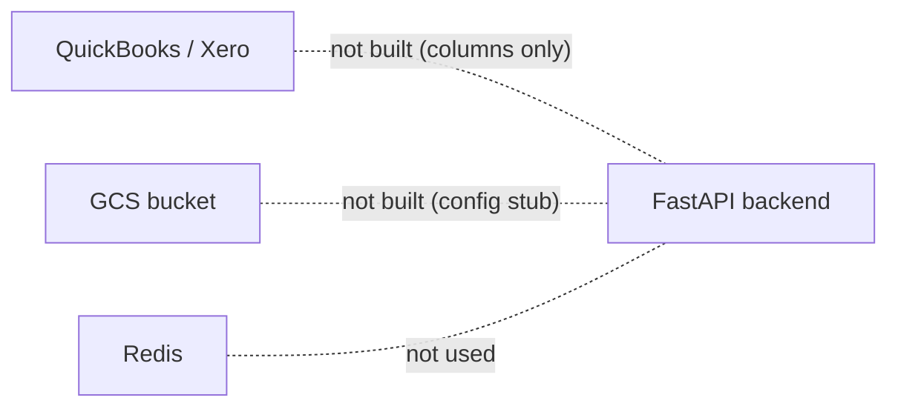

---

## 8. Async / background processing

**None implemented.**
- No Celery, RQ, APScheduler, cron, or worker process.
- The compose `redis` service exists but nothing publishes/consumes.
- Two planned-but-unbuilt workloads depend on this layer: automatic project health computation (models' comments reference a Phase-2+ job) and financial sync.

**State to know:** all work happens synchronously inside request handlers.

---

## 9. File storage

**None implemented.**
- `daily_site_logs.photo_urls` is a `JSONB` list that is always empty in practice; there is no upload endpoint, no multipart handling, no object storage client, no presigned-URL flow.
- Config stubs (`GCS_BUCKET_NAME`) are present but unreferenced.

---

## 10. Notifications

**None implemented.** There is no email/SMS/push/websocket path anywhere in the backend or frontend. Vendor notifications (schedule changes), low-stock alerts, and milestone reminders — all future requirements — have no mechanism today.

---

## 11. Deployment architecture

**Implemented (dev/demo):** `docker-compose.yml` runs `postgres:16`, `redis:7`, and a self-built backend container. Backend uses a multi-stage non-root Dockerfile (builder → runtime), binds port 8080, runs gunicorn with 4 uvicorn workers, has a `/health` healthcheck, and executes `alembic upgrade head` at startup. Frontend is run separately via Vite dev server (not containerized).

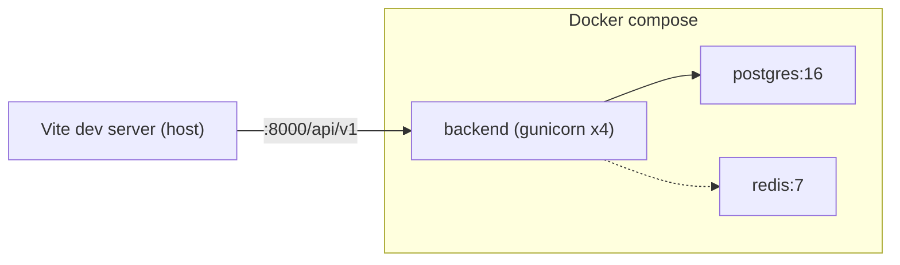

**Not implemented for production:** CI/CD (empty `.github/workflows/`), IaC (empty `infra/terraform/`), Cloud Run/GKE manifests, secrets management, managed/gated migrations, structured log shipping, monitoring/alerting, backups/DR. The Dockerfile is production-shaped but nothing deploys it.

---

## 12. Data flow (example flows)

### Create daily site log (write path)

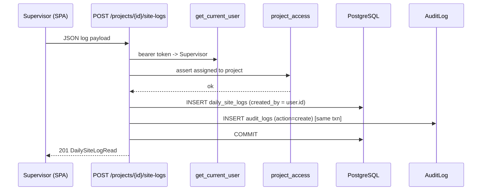

### Record stock movement (write path — row-locked)

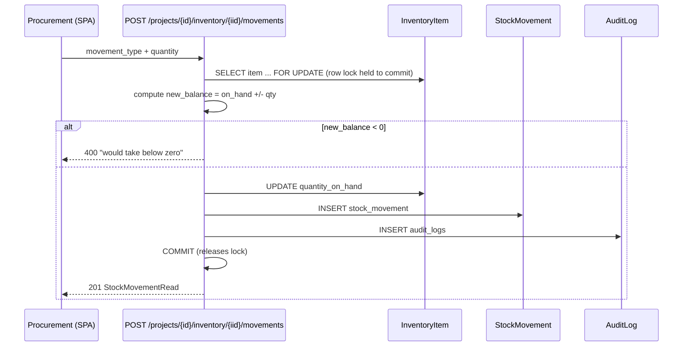

> **Race (RESOLVED, Phase 3 M1):** previously two concurrent movements could both read the same `quantity_on_hand` before either wrote, so the second write clobbered the first. Movements now take a `SELECT ... FOR UPDATE` row lock, serializing writers; `GET /projects/{id}/inventory/reconciliation` detects any legacy drift. Documented in `docs/CURRENT_STATE.md` §6.

### Read path (Command Center)

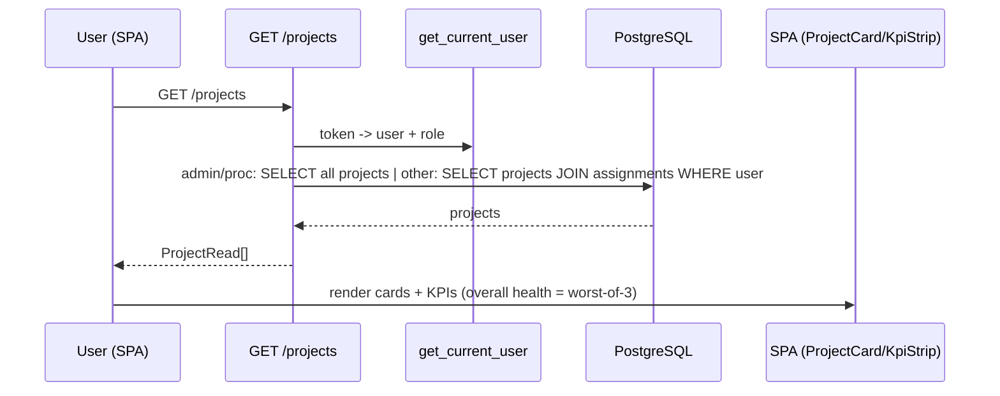

---

## 13. Important architectural decisions (as implemented)

1. **Monolith over microservices** — one FastAPI service, one Postgres DB, one SPA; appropriate for 10–15 projects and a small operations team; keeps migrations and deployments simple for now.
2. **No services/repositories layer** — business logic lives in route handlers. Accepted at current size; becomes refactor-worthy as finance/procurement/quality pillars land.
3. **Async SQLAlchemy + asyncpg end-to-end** — async handlers, async engine, no blocking I/O in hot paths; asyncpg pool (10/20) with `pool_pre_ping`.
4. **Postgres-native types** — UUID PKs, JSONB (audit `changes`, `photo_urls`), native enums, timestamp-with-timezone `created_at`/`updated_at` with `server_default=now()`.
5. **Inventory = ledger + denormalized running total** — `stock_movements` is the immutable, signed source of truth; `quantity_on_hand` is a fast-read cache updated in the same transaction. Sign derived from `movement_type`; negative balance rejected in-app.
6. **Append-only records by convention** — `audit_logs` and `daily_site_logs` are write-once (no update/delete endpoints). Audit entries are written explicitly (not ORM event hooks) and committed atomically with the change.
7. **Money as `Numeric(14,2)`** — decimal, not float; quantities `Numeric(12,2)`.
8. **Application-level RBAC with shared project visibility rules** — admin/procurement global access; supervisor/client gated by `project_assignments`; enforced per-endpoint through shared helpers to avoid divergence.
9. **JWT access token in memory + refresh token in localStorage** — memory-only access reduces XSS lift; localStorage refresh token is the documented trade-off (see `docs/CURRENT_STATE.md` §8).
10. **Rate limiting on auth only** (slowapi, in-memory) — minimal brute-force protection without adding infrastructure; known limitation across multiple workers/proxies.
11. **Exact-pinned dependencies** — two-stage runtime/dev requirements; greenlet pinned explicitly for the async engine.
12. **Migrations committed as Alembic revisions**, single source of truth for DB credentials via app settings; applied at container start in dev.
13. **Code-first schema, verified by tests against real Postgres** — no SQLite emulation; tests create/drop a disposable `ice_test_db` per case.
14. **Decision deferred:** external accounting sync and object storage are deliberately unbuilt (credential/provider decisions pending) rather than scaffolded into production paths.
