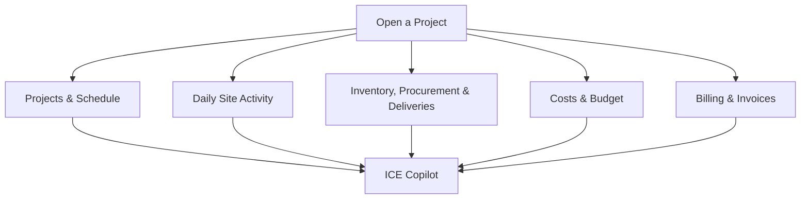
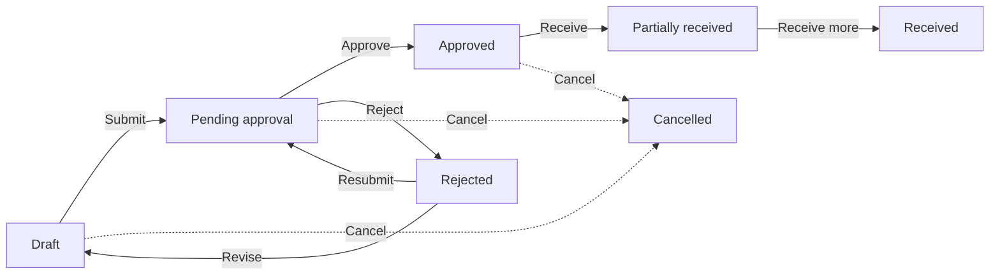

# ICE — Complete User Guide

**Intelligent Construction Engine**

A simple end-to-end guide for Admins, Site Supervisors, Procurement Managers and Clients.

---

This guide explains how to use ICE (Intelligent Construction Engine), the
company's dashboard for running all residential construction sites in one
place. It is written for people who use the app every day — not for
programmers.

**How to use this guide:** read the first few chapters once, then keep it
handy. Every chapter follows the same real path you click through in the app:
**Command Center → open a project → Timeline / Site Logs / Inventory /
Finance / Procurement / Billing**. Examples use a pretend company and sites so
you can picture how you would use it yourself.

| Chapter | What it covers |
|---|---|
| [1. Welcome to ICE](#1-welcome-to-ice) | What ICE does at a glance |
| [2. Signing in](#2-signing-in) | Logging in and signing out |
| [3. Who can see and do what](#3-who-can-see-and-do-what) | The four roles at a glance |
| [4. Your home screen — Command Center](#4-your-home-screen--command-center) | The dashboard, KPIs, and project cards |
| [5. Opening a project](#5-opening-a-project) | The Site Detail page and its sections |
| [6. Timeline & scheduling](#6-timeline--scheduling) | Tasks, Gantt bars, dependencies |
| [7. Daily site logs](#7-daily-site-logs) | Recording what happened on site |
| [8. Project health](#8-project-health) | How sites are rated on-track or at-risk |
| [9. Money — costs & budget](#9-money--costs--budget) | Job costing and budget tracking |
| [10. Billing & invoices](#10-billing--invoices) | Milestones, invoices, payment requests |
| [11. Inventory](#11-inventory) | Stock on site, movements, low stock |
| [12. Vendors & purchase orders](#12-vendors--purchase-orders) | Ordering materials and receiving them |
| [13. Notifications](#13-notifications) | The bell in the top bar |
| [14. ICE Copilot](#14-ice-copilot) | Asking questions in plain language |
| [15. Actions that need approval](#15-actions-that-need-approval) | When ICE asks you to confirm |
| [16. What exists today vs not yet available](#16-what-exists-today-vs-not-yet-available) | Honest limits of the current version |
| [17. Good habits & tips](#17-good-habits--tips) | Small things that keep data trustworthy |

---

## 1. Welcome to ICE

ICE keeps every residential construction project in one place, so a company
owner, an admin, site supervisors, the procurement team, and clients can all
work from the same current truth. Instead of spreadsheets and phone calls,
each site has a page where the schedule, the daily record of what happened on
site, the materials in stock, the money spent, and the invoices raised are all
visible together.

At its heart, ICE works like this:

Every part of a site connects to the others:

- **Projects & Schedule** — the timeline of tasks and when they start and end.
- **Daily Site Activity** — the supervisor's day-to-day log of work done,
  workers present, weather, and issues.
- **Inventory, Procurement & Deliveries** — materials on site, orders placed
  with vendors, and deliveries received against those orders.
- **Costs & Budget** — every rupee spent against each budget, and how much is
  left.
- **Billing & Invoices** — the schedule of payments and the invoices (payment
  requests) sent to clients.
- **ICE Copilot** — a built-in assistant you can ask about any of the above in
  plain English.

> **Important:** ICE keeps a full history of changes and every financial
> record. It is designed so that numbers can be trusted: costs are derived
> from recorded entries, stock levels come from a log of every movement, and
> invoices are generated from milestones — nobody "types in" a magic number.

---

## 2. Signing in

ICE supports two ways to sign in.

**1. Email and password.** Type your email and password on the Sign in page
and click **Sign in**.

**2. Continue with Google.** Click the **Continue with Google** button. You
will be taken to Google to choose the account you were invited with, and ICE
brings you back automatically once Google has verified you.

> **Note:** Google sign-in may show a message that it "isn't configured for
> this workspace yet" — in that case, use your email and password. Google is
> only a way to sign in; your ICE account, role, and project access are
> always managed inside ICE by an admin.

**Signing out.** Click **Sign out** at the bottom of the menu on the left
side of the screen.

> **Tip:** If you were deactivated by an admin, you cannot sign in again
> until they reactivate you — even if your browser still remembers you.

---

## 3. Who can see and do what

There are four roles in ICE. Your role decides which projects you can see and
which actions you can perform. The app hides buttons you are not allowed to
use, and the system also blocks access at the back end — hiding is a
convenience, not the real protection.

| Capability | Admin | Site Supervisor | Procurement Manager | Client |
|---|---|---|---|---|
| See all projects | ✅ | Only assigned sites | ✅ | Only assigned sites |
| See archived projects | ✅ | ❌ (hidden) | ✅ (read-only) | ❌ (hidden) |
| See budgets / money spent | ✅ | ❌ (colour only) | ✅ | ❌ |
| Create projects & manage lifecycle | ✅ | ❌ | ❌ | ❌ |
| Add / edit timeline tasks | ✅ | ✅ (assigned sites) | ❌ | ❌ (read-only) |
| Write daily site logs | ✅ | ✅ (assigned sites) | ❌ | ❌ (read-only) |
| Manage inventory (stock movements) | ✅ | ❌ | ✅ | ❌ |
| Record job costs | ✅ | ❌ | ✅ | ❌ |
| Create billing milestones & invoices | ✅ | ❌ | 👁️ view-only | 👁️ payment requests only |
| Approve / reject purchase orders | ✅ | ❌ | ❌ | ❌ |
| Create & receive purchase orders | ✅ | ❌ | ✅ | ❌ |
| Manage vendors | ✅ | ❌ | ✅ | ❌ |
| Manage users & project assignments | ✅ | ❌ | ❌ | ❌ |
| See computed project health | ✅ | ✅ | ✅ | ❌ |
| Use ICE Copilot | ✅ | ✅ | ✅ | ✅ (read-only) |

> **What "colour only" means:** a supervisor can see whether a project's budget
> is on track (green / amber / red) but never the actual rupee amounts. That
> keeps sensitive figures visible only where they are needed.

---

## 4. Your home screen — Command Center

After you sign in you land on the **Command Center** — one board with every
site you are allowed to see, shown as cards that look like architectural
drawing sheets.

### The left menu (sidebar)

The menu on the left is your navigation:

- **Command Center** — the dashboard (this screen). *(active)*
- **ICE Copilot** — the assistant. *(active)*
- **Inventory**, **Finance**, **Quality & Safety** — shown in the menu with a
  small **"Phase 2"** tag, but **greyed out and not clickable**. They are
  placeholders for future versions; their features already live inside each
  project's page instead.

The top bar shows a **notification bell** (see [Chapter 13](#13-notifications))
and your name.

### The numbers at the top (KPI strip)

A row of summary cards above the project cards:

- **Total sites** — every project you can see.
- **On track / At risk / Off track / Not rated** — how many sites carry each
  health verdict (see [Chapter 8](#8-project-health)). Clients only see
  **Total sites**.
- **Portfolio spend** — the combined percentage of budget spent across all
  sites (Admins and Procurement Managers only).

### Project cards

Each card shows:

- the **project code** (for example `PRJ-2026-0012`),
- the **site name** and **client name**,
- a **status badge** — Draft, Planning, Active, On hold, Completed, or
  Archived,
- a **progress bar** with the percentage complete,
- **health dots** for Timeline, Budget, and Safety — green, amber, or red,
  with the reason in a small tooltip when you hover (not shown to clients),
- the **money row**: for Admins and Procurement Managers, `₹ spent / ₹ total`
  (for example `₹ 48,50,000 / ₹ 1,20,00,000`). Supervisors instead see a
  small "**colour only**" badge for the budget health dot.

### Show archived

Click **Show archived** to include archived sites in the list. Archived sites
are old, closed records kept for reporting. **Clients never see this toggle**,
and only Admins/Procurement Managers receive archived sites in the list.

### Creating a new site (Admin only)

1. Click **New site** (top right).
2. Fill in the **Project name**, **Client name**, **Site address**,
   **Start date**, **Target end date**, and **Budget total (₹)**.
3. Click **Create project**.

The new site appears immediately with a **Draft** status and its own
auto-generated project code.

### Managing your team and vendors from the home screen

Below the project cards you will find two more sections, depending on your
role:

- **TEAM / USERS** (Admins only) — invite people, change roles, activate or
  deactivate accounts. See [Chapter 5](#5-opening-a-project) for assigning
  people to sites.
- **VENDORS** (Admins and Procurement Managers) — the master list of
  suppliers used when creating purchase orders (see
  [Chapter 12](#12-vendors--purchase-orders)).

---

## 5. Opening a project

Click any project card (or its name) to open the **Site Detail** page. At the
top you see:

- a **Back to Command Center** link,
- the site name, project code, client name, and site address,
- a note if the project is **archived** (it is then read-only until restored),
- a **LIFECYCLE** section (Admins only) with the actions that are legal for
  the site's current status: **Activate**, **Mark complete**, **Archive**
  (asks for confirmation), **Restore**.

Below that, the page is a stack of sections, one after another. Not everyone
sees every section — the list depends on your role:

| Section | Who sees it |
|---|---|
| Project Health | Everyone except Clients |
| Start / target / budget / dates summary | All; budget rows only for Admin & Procurement |
| Timeline | Everyone |
| Daily Site Logs | Everyone |
| Inventory | Everyone except Clients |
| Job Cost | Admin & Procurement |
| Billing & Invoices | Admin & Procurement |
| Purchase Orders | Admin & Procurement |
| Payment Requests | Clients only |
| Assigned Team | Admins only |

> **Tip:** the site detail page is the place you will live in every day. The
> next chapters walk through each section in the order it appears on screen.

---

## 6. Timeline & scheduling

The **TIMELINE** section is the site's schedule. Each task (for example
"Foundation", "Plastering", "Electrical wiring") is a horizontal bar drawn
across the project's start-to-end span. The filled part of the bar shows
progress.

Each task shows:

- its **name**,
- a **status badge** — Not started, In progress, Completed, or Blocked,
- a **percentage complete**,
- an arrow tag like `→ Foundation` when it *depends on* another task
  (meaning it can only start after that task finishes).

### Adding a task (Admin / Supervisor)

1. Click **Add task**.
2. Type the **Task name** (for example "Foundation").
3. Pick **Start date** and **End date**.
4. Optionally choose **After: <task>** to make it start only after another
   task finishes.
5. Click **Add task**.

### Editing a task (Admin / Supervisor)

On each task row you can:

- change the **status** from the dropdown,
- drag the **progress slider** to update the percentage,
- edit the **start** and **end dates** directly,
- change which task it **depends on** (or set it to "No dependency"),
- click the small **trash icon** (appears on hover) to delete the task.

### How dependencies keep the plan honest

When you change the dates of a task, ICE automatically **shifts any dependent
tasks forward** so no task starts before the one it depends on is finished.
A notice appears at the top of the section: for example
**"2 tasks shifted to keep dependencies valid"**. You do not need to fix
anything yourself — the plan stays consistent.

> **Important:** dependency shifting only ever moves tasks **later** (forward),
> never earlier. To pull a plan back in, move the earlier tasks' dates.

---

## 7. Daily site logs

The **DAILY SITE LOGS** section is the permanent, day-by-day record of what
happened on site. Supervisors (and Admins) add an entry per day; it cannot be
edited or deleted afterwards — it is an audit record, like a site register.

### Writing a new entry (Admin / Supervisor)

1. Click **New entry**.
2. Set the **date** (defaults to today).
3. Enter **Workers present** (number) and **Weather** (for example
   "Clear").
4. Write what was **completed today** in *Work completed today…*.
5. Optionally note any **Issues / blockers** (these show in amber with a
   warning icon so they stand out).
6. Click **Save log entry**.

Each entry displays the date, worker count, weather, the work summary, and any
issues. Everyone with access to the project can read these entries, including
clients.

> **Tip:** keep summaries factual and specific — "RCC roof slab casting of
> Block B completed; 18 workers present" is far more useful later than "good
> progress".

---

## 8. Project health

**PROJECT HEALTH** is ICE's automatic verdict on how a site is doing. It
looks at real data — not opinions — and colours each area:

- **Timeline** — compares how much of the schedule has elapsed with how much
  work is actually complete.
- **Budget** — compares money spent against physical progress (costs are
  taken from the job-cost ledger, see [Chapter 9](#9-money--costs--budget)).
- **Safety** — currently always shows **Not rated**, because structured
  safety records do not exist yet. It never drags the overall verdict down.

The **Overall** verdict is the worst of the rated areas. Three colours are
used across the app:

| Colour | Meaning |
|---|---|
| 🟢 **Green** | On track |
| 🟡 **Amber** | At risk |
| 🔴 **Red** | Off track |
| ⚪ **Grey** | Not rated — not enough data |

Each area lists the specific reasons behind the verdict (for example
"Project is 82% complete but 95% of the schedule has elapsed"), and the card
on the dashboard shows the same dots, so you can spot problem sites without
opening them.

A few things worth knowing:

- Draft and Planning projects are **not rated** (they have not started).
- Completed projects keep their final verdict and are marked **Frozen —
  reflects completion state**.
- Archived projects show no colours.

### Overriding a verdict (Admin only)

If a machine-computed verdict is wrong because of something unusual (for
example a monsoon ground-water problem legitimately re-baselines the
timeline), an Admin can set a manual override:

1. In the **HEALTH OVERRIDE** box choose **Applies to** (Overall, Timeline,
   Budget, or Safety).
2. Choose the **Verdict** (Green / Amber / Red).
3. Write a **Reason** (at least 10 characters) — this is kept as the record
   of *why*.
4. Optionally set **Expires after (days)** so the override lapses
   automatically.
5. Click **Set override**.

The override history is shown below the form, and any active override can be
**Revoked** (the history is kept). Overrides are visible to all roles that can
see health, and each override is recorded with who set it and when.

---

## 9. Money — costs & budget

The **JOB COST** section tracks every rupee spent on the project. It is the
source of truth behind the **Budget / Spent / Remaining** figures at the top
of the section, and behind the Budget health verdict.

At the top you see three figures:

- **Budget** — the total approved budget for the project.
- **Spent** — the sum of all recorded costs.
- **Remaining** — what is left.

### Recording a cost (Admin / Procurement Manager)

1. Click **Add cost**.
2. Choose the **cost code** — the trade the money went to: Foundation,
   Structure, Masonry, Roofing, Electrical, Plumbing, HVAC, Finishing,
   Landscaping, Labor, Material, Equipment, or Other.
3. Enter a **Description** (for example "Steel for slab — 4.2 tonnes").
4. Enter the **Amount (₹)**.
5. Set the **date** it was incurred.
6. Click **Add cost**.

Every cost appears in the list below and immediately updates the Spent and
Remaining figures. There is no way to type a "spent so far" number directly —
spent is always the sum of the recorded entries, which is what makes the
numbers trustworthy.

> **Important:** receiving materials against a purchase order also creates
> cost entries automatically (see [Chapter 12](#12-vendors--purchase-orders))
> — so materials you receive show up in both inventory *and* costs without
> double entry.

---

## 10. Billing & invoices

The **BILLING & INVOICES** section turns the project's contract into payment
requests. It shows three figures at the top:

- **Contract** — the project's total contract value (its budget total).
- **Invoiced** — the total value of invoices raised (excluding cancelled).
- **Outstanding** — invoices issued but not yet paid.

### The schedule of milestones (Admin only)

Billing works from a **schedule of values** — the milestones in the contract.
Each milestone carries exactly one rule:

- **% of contract** — for example 10%, meaning the milestone bills 10% of the
  contract, or
- **Fixed amount** — a set rupee value.

**To add a milestone:** click **Add milestone**, give it a **name** (for
example "Slab casting"), choose the rule, fill in the percentage or amount,
optionally add a description, and click **Add milestone**.

### From milestone to invoice

The flow is always the same and each step needs the previous one:

1. A milestone is created and sits as **Not started**.
2. When the work for that milestone is done, click **Complete** — its badge
   turns **Completed**.
3. Only a completed milestone can be invoiced: click **Generate invoice**.
   ICE calculates the amount automatically from the milestone rule — nobody
   types the amount. The new invoice is a **Draft** with its own number
   (for example `INV-PRJ-2026-0012-3`) and a due date 30 days later.

### The invoice's life

Each invoice shows its number, milestone, status badge, due date, and amount,
and goes through these states:

| Status | Meaning | What you can do |
|---|---|---|
| **Draft** | Created but not sent | **Issue** it |
| **Issued** | Sent to the client | **Mark paid** or **Cancel** |
| **Paid** | Received the money | — |
| **Cancelled** | Void (shown struck through) | A cancelled invoice frees its milestone to be re-invoiced |
| **Overdue** | Issued and past its due date (shown in red) | — |

> **Note:** Invoice amounts, numbering, and due dates are generated by ICE.
> Admins can issue, mark paid, and cancel; Procurement Managers can view the
> whole schedule but cannot create or change anything.

### For clients: Payment Requests

Clients do not see the Billing & Invoices section. Instead they see a
**PAYMENT REQUESTS** section listing only their own issued invoices (number,
milestone, status, due date, overdue flag, amount). Draft invoices are never
shown to clients, and clients cannot see notes, rules, or budget figures.

---

## 11. Inventory

The **INVENTORY** section tracks the materials held at the site. Each item
shows its **name**, the **quantity on hand**, and its **unit** (bags, kg, m³,
etc.).

A stock item appears in amber with a **Low stock** flag when its quantity has
dropped to or below its reorder threshold.

### Adding a material (Admin / Procurement Manager)

1. Click **Add item**.
2. Enter the **Material name** (for example "Cement OPC 53"), the **unit**
   (bags, kg, m³…), and the **Opening qty**.
3. Click **Add item**.

### Recording stock movements (Admin / Procurement Manager)

Every change in stock is recorded as a **movement**, so the quantity on hand
always has a paper trail. Click **Record movement** on an item and choose:

| Movement | Effect on stock |
|---|---|
| **Received (+)** | Adds to on-hand (deliveries in) |
| **Consumed (−)** | Removes from on-hand (used on site) |
| **Transferred out (−)** | Removes (sent to another site) |
| **Adjusted (+)** | Corrects a count |

Enter the quantity, optionally add a **note**, and click **Save movement**.

> **Important:** ICE will refuse a movement that would push stock below zero.
> Receiving materials through a purchase order also records a `Received`
> movement automatically (see the next chapter), so stock and purchasing stay
> in sync.

---

## 12. Vendors & purchase orders

Procurement works in two halves: the **vendor master list** (managed from the
Command Center's **VENDORS** section) and the **PURCHASE ORDERS** section
inside each project.

### The vendor list (Admin / Procurement Manager)

- Click **Add vendor** and fill in name, contact, email, phone, payment terms
  (for example "NET 30"), address, and notes.
- Use the **Active / Deactivated** button to switch a vendor off (for
  example when they are no longer used). Deactivated vendors no longer appear
  when creating new orders, but their history is kept.

### Creating a purchase order (Admin / Procurement Manager)

1. Inside a project, click **Create PO**.
2. Pick the **Vendor**.
3. Set the **Order date**, optional **Expected delivery**, **Tax rate %**,
   and **Notes**.
4. Under **LINES**, add each material: **Description**, **Qty**, **Unit**,
   **Unit price**, and **Cost code** (the trade that will carry the cost).
   Use **Add line** for more than one item.
5. Click **Create purchase order**.

ICE totals each line (qty × price) and the order total (lines + tax)
automatically.

### The order's journey

A purchase order moves through a fixed set of states. Only legal actions are
offered at each step:

- **Draft** — you can add, edit, and remove lines, or **Submit** it
  (needs at least one line).
- **Pending approval** — a **Purchase Order Approval** is needed. Only an
  **Admin** can click **Approve** or **Reject** (rejection requires a reason,
  which is recorded and shown on the order).
- **Approved** — the order is live.
- **Received / Partially received** — what actually came in (see below).
- **Rejected** — you can **Revise** (go back to Draft) or **Resubmit**.
- **Cancelled** — void. Only an Admin can cancel an approved order.

> **Note:** once a project is **Completed**, purchase orders are frozen (no
> new orders); when a project is **Archived**, everything becomes read-only.

### Receiving an order (Admin / Procurement Manager)

When materials arrive, verify them against the order:

1. On an **Approved** (or partially received) order, click **Receive**.
2. Enter the **Delivery / packing-slip reference** (for example `DN-1042`),
   an optional **Verification note**, and an optional **Photo reference**.
3. For each line, set the **quantity** received and pick the matching
   **inventory item** (choose an existing item of the same unit, or add one
   first in the Inventory section).
4. Click **Verify & receive**.

Receiving is the *only* way ordered materials enter the system: it adds a
`Received` stock movement to inventory **and** a job cost (so budget spend
updates too), in one step. Each delivery is kept as a permanent record you
can expand under the order's **Deliveries** section.

---

## 13. Notifications

The **bell** in the top-right corner shows your notifications — with a red
badge counting unread ones. ICE creates them automatically when something
happens that concerns you:

- a **schedule shift** (tasks moved to keep dependencies valid) — for
  assigned supervisors and Admins,
- an **invoice issued** (a payment request) — for the assigned client and
  Admins,
- a **low-stock crossing** (stock at/below threshold) — for Procurement
  Managers and Admins,
- a **project assignment** — when someone is assigned to a site,
- a **purchase order submitted / approved / rejected** — to Admins and the
  order's creator.

Open the bell to see the feed. Click a notification to open the relevant
screen (it is marked as read automatically), use **All** to mark everything
read, or hover over the red dot count. The bell refreshes itself, so new items
appear without reloading the page.

> **Note:** notifications are **in-app only** today — there is no email or
> phone push yet (see [Chapter 16](#16-what-exists-today-vs-not-yet-available)).

---

## 14. ICE Copilot

**ICE Copilot** (in the left menu) is an assistant built into the platform.
You ask questions in plain English and it answers using the project data you
are allowed to see.

### Asking a question

1. Open **ICE Copilot** from the menu.
2. Type your question in the box at the bottom (for example "Which projects
   need attention?" or "Show inventory for Green Heights").
3. Press **Enter** (or click **Send**).

The Copilot answers while showing small chips for the tools it uses, such as
"Checking Project health…" or "Checking Inventory…". You can click one of the
example question buttons on the first screen to get started.

Useful example questions:

- "Show my projects."
- "Which projects need attention?"
- "What is the budget situation for a project?"
- "Show inventory for a project."
- "What purchase orders are open for a project?"
- "What notifications need my attention?"

### A few things to know

- **Conversation memory** — the Copilot remembers the current chat, so follow-ups
  like "and what about its timeline?" work. **New chat** starts a fresh
  conversation.
- **Role-aware** — the Copilot can only see and answer about the same projects
  and data your role allows. A client gets read-only answers about their own
  sites only.
- **Web search** — when enabled for the workspace, the Copilot can look up
  external information (for example market prices) and will clearly separate
  "our data" from "web references". Web search is reference material, never
  authoritative.
- **Stop** — you can stop a long answer at any time with the **Stop** button.
- **Approval-gated** — when the Copilot proposes a change (see the next
  chapter), it pauses and shows an approval card instead of acting by itself.

> **Tip:** the Copilot answers from the same records you see in the app. If
> something looks off, it usually means the underlying data needs attention —
> treat it as a helpful pointer, and always confirm important numbers before
> acting on them.

---

## 15. Actions that need approval

ICE never lets the Copilot change anything on its own. The two actions the
Copilot can propose — **creating a task** and **creating a daily site log**
— are paused for a human decision first, and this feature is switched **off**
by default in the current version (see the next chapter). If it is switched on
for your workspace, the chat shows a card:

**"Action requires approval"**

with a summary of what the Copilot wants to do and three choices:

- **Approve** — run the action exactly as proposed.
- **Edit** — change the values (for example the task's name or dates) in the
  form that appears, then **Submit edit**.
- **Reject** — do nothing.

Two safety rules matter here:

1. **Approval never grants access.** Even if you approve, the action still
   only runs if your role and project access allow it.
2. **An approval works exactly once.** Replaying the same approval (double
   click, retry, refresh) cannot create a duplicate task or log entry — ICE
   replies that there is nothing pending.

> **Important:** approving the Copilot is exactly like doing the action
> yourself — it is recorded, counted, and audited the same way.

---

## 16. What exists today vs not yet available

This version of ICE is complete for the workflows described above, but some
items from the long-term vision are **not yet available**. Knowing the
difference saves you from hunting for features that are not there.

### Available today

- Email/password sign-in, and Google sign-in when configured.
- Command Center with project cards, health dots, and KPIs.
- Projects with a lifecycle: Draft → Active → Completed → Archived (and
  Restore), all managed by Admins.
- Timeline with tasks, Gantt bars, progress, and dependency-aware scheduling.
- Daily site logs (text entries; **not** editable or deletable afterwards).
- Computed project health (Timeline + Budget) with Admin overrides.
- Job costing by trade, with derived budget figures.
- Billing milestones and invoices with derived amounts; client payment
  requests.
- Inventory with a full movement ledger and low-stock flags.
- Vendors, purchase orders with admin approval, and delivery verification
  ("receiving").
- In-app notifications (bell).
- ICE Copilot (read-only answers; the two change actions are off by default).
- Audit trail and full history of changes.

### Not yet available (planned for later versions)

| Area | What's missing |
|---|---|
| **Sidebar pages** | **Inventory**, **Finance**, and **Quality & Safety** items in the menu are greyed out and **not clickable** — those features live inside each project page for now. |
| **Photos & voice** | Daily site logs have no photo upload or voice-to-text capture yet. |
| **Mobile / offline** | ICE is a desktop web app; there is no phone app and no offline mode. |
| **Notifications out of the app** | No email, SMS, or push — notifications appear in the bell only. |
| **Safety records** | No structured safety/quality data, so the Safety health area stays "Not rated". |
| **Multi-location inventory** | Stock is tracked per site only (no warehouse/transit locations yet). |
| **Low-stock forecasting** | Alerts use fixed thresholds; there is no 7-day demand forecast yet. |
| **External accounting** | No QuickBooks/Xero-style export or sync. |
| **Cross-project reports** | No portfolio-wide inventory or finance roll-ups beyond the Command Center KPIs. |
| **Copilot changes** | The Copilot is read-only by default; its task/log-creation is off unless a workspace admin enables it. |

> **Bottom line:** if you cannot find a button described in an old demo or a
> brochure, it is probably one of the rows above — the menu items
> **Inventory**, **Finance**, and **Quality & Safety** in particular are
> disabled placeholders.

---

## 17. Good habits & tips

A few habits keep ICE's records trustworthy — and ICE's numbers are only as
good as what people type in.

- **Log the site every working day.** Even a short daily log entry keeps the
  record complete; issues recorded the same day are far more reliable than
  ones written from memory a week later.
- **Record costs and movements as they happen.** Spent, remaining, stock
  levels, and the Budget health verdict all derive from these entries — a
  missing entry is an invisible error.
- **Use the right cost code.** "Material" vs "Masonry" changes how reports
  and budgets are read. When in doubt, ask the admin how your company groups
  costs.
- **Set realistic task dependencies.** The plan auto-adjusts around them, so
  linking "plastering after masonry" keeps later dates honest.
- **Check the notification bell.** It is the fastest early warning for
  schedule shifts, low stock, and new payment requests.
- **Use the Copilot for quick lookups**, but confirm anything important in
  the project page — the page is the record, the Copilot is the helper.
- **Leave an audit trail when overriding health.** The reason field is
  mandatory for a reason: it is the only explanation anyone will see later.
- **Ask an Admin for account changes.** Roles, site assignments, and
  reactivation are all managed by an Admin from the TEAM / USERS section.

---

*End of guide. If something in the app disagrees with this document, the app
is the current truth — ICE evolves, and this guide is updated as features
land.*